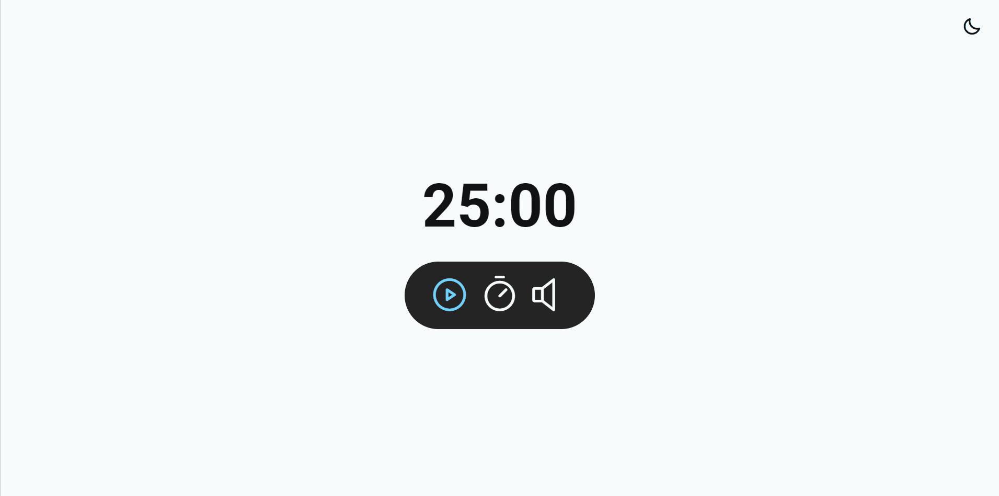

<h1 align="center"> Focus Timer </h1>

 

  

## Sobre o desafio

Este foi um projeto com JavaScript realizado através do curso da rocketseat, com anexo de áudios.   

## Tecnologias utilizadas

Esse projeto foi desenvolvido com as seguintes tecnologias:

- HTML
- CSS
- JavaScript
- Github
- Figma